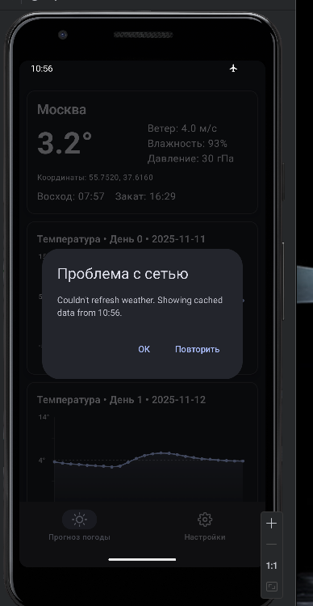
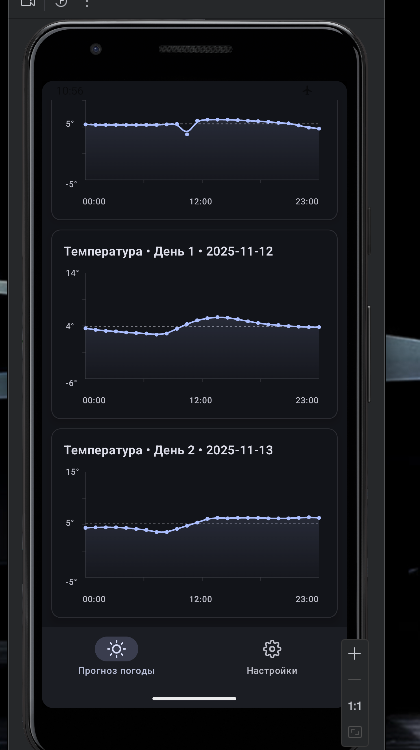

# **Android & iOS CMP/KMP Project**

<table style= padding:10px">
  <tr>
    <td>   </td>
    <td>   </td>
    <td>   </td>
  </tr>
</table>

Проект содержит **Android**, **iOS** и **общий KMP-модуль** (кроссплатформенное приложение). Общий модуль написан на Kotlin и переиспользуется между платформами: UI на **Compose Multiplatform**, бизнес-логика, сетевой слой и кэш.

### **Используемые технологии**
-   **Compose Multiplatform** — общий декларативный UI для Android и iOS.
-   **Kotlin Multiplatform** — иерархическая структура исходников и общий код.
-   **Decompose** — навигация и жизненный цикл компонент (BLoC), независимая от UI.
-   **Ktor Client** — кроссплатформенный HTTP-клиент.
-   **Koin** — DI c поддержкой Compose Multiplatform.
-   **Multiplatform Settings** — единое key-value-хранилище вместо SharedPreferences/UserDefaults.

----------
### **Основные функции**
- Единый UI написанный на Jetpack Compose и логика для Android и iOS (минимум платформенного кода).
- Экран с погодной информацией: текущая, почасовая (для текущего дня) и прогноз погоды (3 дня) для Москвы
- Индикатор загрузки (Шиммер цвета радуги с эффектом подсветки/тени)
- Диалог оповещающий о проблемах в загрузке данных с Интернета
- Pull to refresh механизм
- Навигация через дерево компонент Decompose (root/children, back-stack).
- Сетевой слой на Ktor (таймауты/ретраи/логирование, мульти-энджины).
- DI на Koin (инъекция в общих и UI-модулях Compose MP).
- Настройки/кэш в Multiplatform Settings (один API во всех таргетах).
- Offline-first решение, загруженная с сети погода кэшируется и воспроизводится
- Ночная/дневная тема
- Сохранение API ключа в keys.properties файле, который можно потом скрыть для публикации

## **Функции, которые ещё можно добавить**

-   **Модули-фичи**: разнести экраны по feature/* с собственным DI и компонентами Decompose.

-   **SPM/CocoaPods/XCFramework** интеграция для iOS, если нужен иной способ поставки.

-   **CI/CD**: сборка Android AAB/APK и iOS XCFramework на CI (KMP/Compose MP гайды есть у JetBrains).

-  **Доработать дизайн**

